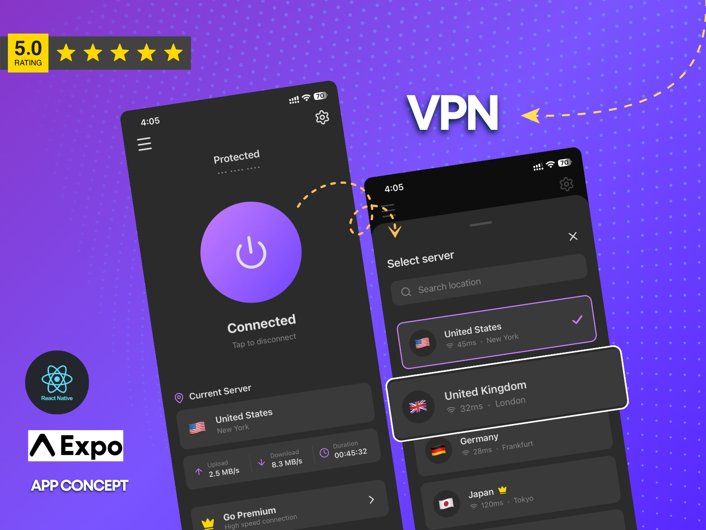

# VPN App

A modern VPN application concept built with React Native and Expo.


## 📱 Preview



## ✨ Features

- **One-Tap Connection**: A central, animated connection button with dynamic water-filling and shaking effects to visualize connection states (Connecting, Connected, Disconnecting).
- **Server Selection**: An intuitive modal for browsing and selecting global servers, complete with flag icons and latency indicators.
- **Real-time Stats**: Visual cards displaying download/upload speeds, connection duration, and ping.
- **Premium UI**: Utilizes glassmorphism, rich linear gradients, and custom SVG icons for a high-end aesthetic.
- **Smooth Animations**: Interactive elements that respond to user touch, making the app feel alive.

## 🛠️ Tech Stack

- **Framework**: [React Native](https://reactnative.dev/) with [Expo](https://expo.dev/)
- **Styling**: `expo-linear-gradient` for backgrounds, Custom CSS-in-JS
- **Icons**: [Lucide React Native](https://lucide.dev/guide/packages/lucide-react-native)
- **Graphics**: `react-native-svg`

## 🚀 Getting Started

Follow these steps to run the project locally:

1.  **Clone the repository**
    ```bash
    git clone https://github.com/Naimur444/vpn-app.git
    cd vpn-app
    ```

2.  **Install dependencies**
    ```bash
    npm install
    ```

3.  **Start the app**
    ```bash
    npx expo start
    ```

4.  **Run on device/emulator**
    - Scan the QR code with the Expo Go app (Android/iOS).
    - Press `a` for Android Emulator.
    - Press `i` for iOS Simulator.

## 📂 Project Structure

```
src/
├── components/
│   ├── ConnectionButton.js  # Main interactive button with animations
│   ├── ServerModal.js       # Server selection interface
│   ├── StatsCard.js         # Connection statistics display
│   ├── ServerCard.js        # Individual server display component
│   ├── Header.js            # App navigation header
│   └── Button.js            # Reusable button component
├── screens/
│   └── HomeScreen.js        # Main dashboard screen
├── constants/               # App constants (colors, layout)
└── utils/                   # Helper functions
```

## 📄 License

This project is open source and available under the [MIT License](LICENSE).

---

